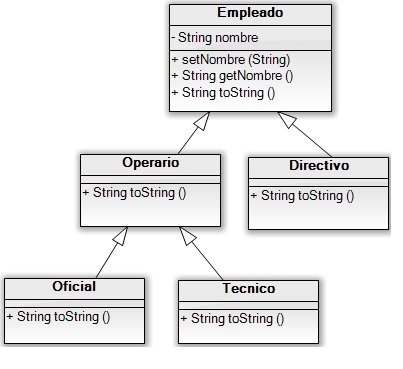

# Ejercicio Resuelto Herencia en Java

Codifica la siguiente jerarquía de clases java representada por este diagrama UML:



La clase base es la clase Empleado. Esta clase contiene:

* Un atributo privado nombre de tipo String que heredan el resto de clases. 
* Un constructor por defecto.
* Un constructor con parámetros que inicializa el nombre con el String que recibe.
* Método set y get para el atributo nombre.
* Un método toString() que devuelve el String: "Empleado " + nombre.

El resto de clases solo deben sobrescribir el método toString() en cada una de ellas y declarar el constructor adecuado de forma que cuando la ejecución de las siguientes instrucciones:

```java
Empleado E1 = new Empleado("Rafa");
Directivo D1 = new Directivo("Mario");
Operario OP1 = new Operario("Alfonso");
Oficial OF1 = new Oficial("Luis");
Tecnico T1 = new Tecnico("Pablo");
System.out.println(E1);
System.out.println(D1);
System.out.println(OP1);
System.out.println(OF1);
System.out.println(T1);
```

Den como resultado:

```
Empleado Rafa
Empleado Mario -> Directivo
Empleado Alfonso -> Operario
Empleado Luis -> Operario -> Oficial
Empleado Pablo -> Operario -> Tecnico
```

